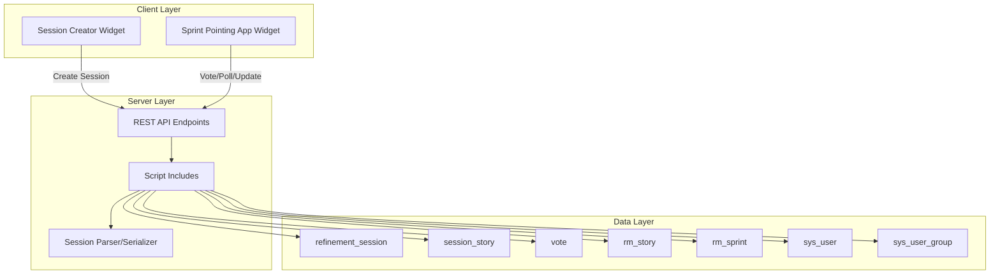

# Design Document

## Overview

This design document specifies the technical implementation for Version 3 of the Sprint Pointing application. V3 focuses on 15 targeted enhancements and defect fixes to improve usability, visual presentation, and data management while preserving the existing V2 architecture and voting workflow.

The enhancements fall into four categories:

1. **UI/UX Improvements**: Sprint dropdown sorting, session link copying, timer visibility, layout fixes, interface scaling, duck icon vote option
2. **Real-time Updates**: Live participant count, vote results display for participants
3. **Data Management**: Editable reference fields, story details reordering, sprint pointing parser/serializer
4. **Visual Presentation**: Participant avatars, ServiceNow portal header removal, finalize button visibility

The design maintains backward compatibility with V2 sessions and leverages existing ServiceNow infrastructure including the Service Portal framework, REST API endpoints, and real-time polling mechanisms.

## Architecture

### System Context

The Sprint Pointing application operates within the ServiceNow platform as a scoped application (x_1326913_sp_point). The architecture consists of three layers:

1. **Presentation Layer**: Service Portal widgets (Session Creator, Sprint Pointing App)
2. **Application Layer**: Script Includes containing business logic
3. **Data Layer**: Custom tables (refinement_session, session_story, vote) and ServiceNow tables (rm_story, rm_sprint, sys_user, sys_user_group)

### Component Architecture



### V3 Enhancement Integration

V3 enhancements integrate into the existing architecture without structural changes:

- **Frontend enhancements** modify widget client controllers and HTML templates
- **Backend enhancements** extend existing Script Includes with new methods
- **Data enhancements** add serialization/parsing utilities without schema changes
- **Real-time updates** leverage the existing polling mechanism (no WebSocket changes)

## Components and Interfaces

### Frontend Components

#### Session Creator Widget Enhancements

**Purpose**: Enable moderators to create sessions with improved sprint selection

**Enhancements**:
- Sprint dropdown with numerical sorting
- Session link copy functionality with visual feedback

**Key Methods**:
```javascript
// Client Controller
c.sortSprintsNumerically(sprints)
  // Input: Array of sprint objects with name property
  // Output: Array sorted by extracted numeric value
  // Algorithm: Extract numeric portion using regex, sort numerically

c.copySessionLink()
  // Input: Session link URL string
  // Output: None (side effects: clipboard update, toast message)
  // Behavior: Select text, copy to clipboard, show "Link copied!" for 2s
```

#### Sprint Pointing App Widget Enhancements

**Purpose**: Provide real-time voting interface for moderators and participants

**Enhancements**:
- Timer visibility for all participants
- Timer layout spacing fix
- Vote results display for participants
- Live participant count updates
- Participant avatar display
- Duck icon vote option
- Finalize button visibility fix
- ServiceNow portal header removal
- Story details field reordering
- Editable story reference fields
- Interface scale enhancement (20% increase)

**Key Methods**:
```javascript
// Client Controller
c.pollSession()
  // Enhanced to update: timer state, participant count, vote results
  // Polling interval: 2 seconds (existing V2 mechanism)

c.updateTimerDisplay(remainingSeconds)
  // Input: Integer seconds remaining
  // Output: None (updates UI with MM:SS format and progress bar)

c.displayVoteResults(results)
  // Input: Vote results object with distribution and individual votes
  // Output: None (renders chart and participant votes with avatars)

c.getUserAvatar(userId)
  // Input: sys_user sys_id
  // Output: Avatar URL or initials-based fallback
  // Behavior: Query sys_user.photo, generate initials if null

c.updateParticipantCount(count)
  // Input: Integer participant count
  // Output: None (updates "Participants: N" display)

c.initializeReferenceFields()
  // Input: None
  // Output: None (initializes ServiceNow reference field widgets)
  // Behavior: Attach autocomplete to Assignment Group, Assigned To, Sprint
```

**CSS Enhancements**:
```css
/* Base font size increase */
body { font-size: 19px; } /* was 16px */

/* Voting card scale */
.voting-card {
  width: 96px; /* was 80px, 20% increase */
  height: 144px; /* was 120px, 20% increase */
}

/* Spacing increase */
.voting-section { margin-top: 19.2px; } /* was 16px, 20% increase */

/* Timer layout */
.timer-container {
  margin-top: 16px; /* minimum spacing from header */
}

/* Finalize button positioning */
.finalize-button {
  margin-top: 16px; /* minimum spacing from votes */
  text-align: center;
}

/* Portal header removal */
#sp-nav-bar { display: none; }
```

### Backend Components

#### Session Management Script Include

**Purpose**: Handle session lifecycle and state management

**Enhancements**:
- Session state serialization/parsing
- Participant count tracking

**Key Methods**:
```javascript
// Script Include: SprintPointingSessionManager
serializeSession(sessionId)
  // Input: Session sys_id
  // Output: JSON string representation of session state
  // Includes: session metadata, stories, votes, participants

parseSession(jsonString)
  // Input: JSON string
  // Output: Session object or error
  // Validation: Schema validation, reference integrity

getParticipantCount(sessionId)
  // Input: Session sys_id
  // Output: Integer count of active participants
  // Query: Count distinct user_id from vote table where session_id matches
```

#### Story Management Script Include

**Purpose**: Handle story metadata updates

**Enhancements**:
- Reference field updates (Assignment Group, Assigned To, Sprint)

**Key Methods**:
```javascript
// Script Include: SprintPointingStoryManager
updateStoryReference(storyId, fieldName, referenceId)
  // Input: Story sys_id, field name, reference sys_id
  // Output: Boolean success
  // Validation: Verify reference exists in target table
  // Fields: assignment_group (sys_user_group), assigned_to (sys_user), sprint (rm_sprint)
```

#### Pretty Printer Utility

**Purpose**: Format session objects for debugging and logging

**New Component**:
```javascript
// Script Include: SprintPointingPrettyPrinter
format(sessionObject)
  // Input: Session object
  // Output: Formatted JSON string with 2-space indentation
  // Behavior: JSON.stringify with indent parameter
```

### REST API Endpoints

**Existing endpoints** (preserved from V2):
- POST /api/x_1326913_sp_point/session/create
- POST /api/x_1326913_sp_point/session/vote
- GET /api/x_1326913_sp_point/session/poll
- POST /api/x_1326913_sp_point/session/reveal
- POST /api/x_1326913_sp_point/session/finalize

**Enhanced endpoints** (V3 modifications):
- GET /api/x_1326913_sp_point/session/poll
  - Additional response fields: participant_count, timer_state, vote_results_for_participants
- POST /api/x_1326913_sp_point/story/update_reference
  - New endpoint for reference field updates
  - Request: { story_id, field_name, reference_id }
  - Response: { success, error_message }

## Data Models

### Session State Object

The session state object represents the complete state of a pointing session for serialization/parsing:

```javascript
{
  "session_id": "sys_id_string",
  "moderator_id": "sys_id_string",
  "sprint_id": "sys_id_string",
  "created_at": "ISO8601_timestamp",
  "status": "active|completed",
  "current_story_id": "sys_id_string|null",
  "timer_state": {
    "active": boolean,
    "remaining_seconds": integer,
    "total_seconds": integer
  },
  "participants": [
    {
      "user_id": "sys_id_string",
      "user_name": "string",
      "joined_at": "ISO8601_timestamp"
    }
  ],
  "stories": [
    {
      "story_id": "sys_id_string",
      "story_number": "string",
      "short_description": "string",
      "assignment_group": "sys_id_string",
      "assigned_to": "sys_id_string",
      "sprint": "sys_id_string",
      "points": integer|null,
      "opened": "ISO8601_timestamp",
      "opened_by": "sys_id_string"
    }
  ],
  "votes": [
    {
      "vote_id": "sys_id_string",
      "story_id": "sys_id_string",
      "user_id": "sys_id_string",
      "vote_value": "string", // "1", "2", "3", "5", "8", "13", "pass"
      "voted_at": "ISO8601_timestamp"
    }
  ]
}
```

### Vote Results Object

The vote results object represents the outcome of voting for display to all participants:

```javascript
{
  "story_id": "sys_id_string",
  "distribution": {
    "1": integer_count,
    "2": integer_count,
    "3": integer_count,
    "5": integer_count,
    "8": integer_count,
    "13": integer_count,
    "pass": integer_count
  },
  "individual_votes": [
    {
      "user_id": "sys_id_string",
      "user_name": "string",
      "avatar_url": "string|null",
      "initials": "string",
      "vote_value": "string"
    }
  ],
  "consensus": boolean,
  "final_value": "string|null"
}
```

### User Avatar Object

The user avatar object represents display information for participant identification:

```javascript
{
  "user_id": "sys_id_string",
  "avatar_url": "string|null", // ServiceNow user photo URL if exists
  "initials": "string", // First char of first name + first char of last name
  "full_name": "string"
}
```


## Correctness Properties

*A property is a characteristic or behavior that should hold true across all valid executions of a system—essentially, a formal statement about what the system should do. Properties serve as the bridge between human-readable specifications and machine-verifiable correctness guarantees.*

### Property Reflection

After analyzing all acceptance criteria, I identified the following redundancies:
- Properties 2.2 and 2.5 test the same clipboard copy behavior (triggered by different UI elements)
- Properties 5.1, 5.2, and 5.3 all test vote reveal timing and can be combined into one comprehensive property
- Properties 6.1 and 6.2 test participant count updates and can be combined into one bidirectional property
- Properties 11.2 and 11.3 are redundant with 11.1 (they specify parts of the same ordering)
- Properties 15.1 and 15.2 are subsumed by 15.4 (the round-trip property validates both)

The following properties provide unique validation value and will be included:

### Property 1: Sprint Numerical Sorting

*For any* collection of sprint names containing numeric portions, sorting them using the sprint sorting algorithm should result in numeric ascending order where Sprint 1 precedes Sprint 2, and Sprint 9 precedes Sprint 10.

**Validates: Requirements 1.1, 1.2**

### Property 2: Session Link Clipboard Copy

*For any* session link, clicking the link field or copy button should copy the exact link text to the system clipboard.

**Validates: Requirements 2.1, 2.2, 2.5**

### Property 3: Timer Display Format

*For any* remaining time value in seconds, the timer display should format it as "Voting Time Remaining MM:SS" where MM and SS are zero-padded two-digit values.

**Validates: Requirements 3.2**

### Property 4: Timer Progress Bar Monotonicity

*For any* timer state, as time elapses, the progress bar value should decrease monotonically (never increase).

**Validates: Requirements 3.3**

### Property 5: Timer Synchronization

*For any* active voting session with multiple participants, when the timer updates, all participant displays should show the same time value within 1 second of each other.

**Validates: Requirements 3.4**

### Property 6: Timer Visibility for All Users

*For any* voting session, when voting begins, the timer should be visible to all participants and the moderator.

**Validates: Requirements 3.1**

### Property 7: Layout Non-Overlap

*For any* viewport size and content state, the timer display should not overlap with any other interface elements.

**Validates: Requirements 4.3**

### Property 8: Vote Results Display Synchronization

*For any* voting session, when the moderator triggers vote reveal, all participants should see the vote distribution chart, individual votes, and final result within 1 second.

**Validates: Requirements 5.1, 5.2, 5.3**

### Property 9: Vote Results Consistency

*For any* vote result, the displayed information should be identical for all participants and the moderator.

**Validates: Requirements 5.4**

### Property 10: Participant Count Updates

*For any* session, when a user joins or leaves, the displayed participant count should update within 2 seconds to reflect the change (increment for join, decrement for leave).

**Validates: Requirements 6.1, 6.2**

### Property 11: Participant Count Format

*For any* participant count value N, the display should show "Participants: N" where N is the current count.

**Validates: Requirements 6.3**

### Property 12: Dynamic Participant Count Updates

*For any* participant count change, the UI should update without requiring a page refresh.

**Validates: Requirements 6.5**

### Property 13: Avatar Display for All Participants

*For any* participant list in vote results, each participant name should have an avatar icon displayed to the left.

**Validates: Requirements 7.1**

### Property 14: User Photo Avatar Display

*For any* participant with a ServiceNow user photo, the avatar should display that photo.

**Validates: Requirements 7.2**

### Property 15: Initials Fallback Avatar

*For any* participant without a ServiceNow user photo, the avatar should display the user's initials.

**Validates: Requirements 7.3**

### Property 16: Initials Generation Algorithm

*For any* user with a first name and last name, the initials should be generated by taking the first character of the first name and the first character of the last name.

**Validates: Requirements 7.4**

### Property 17: Duck Card Vote Recording

*For any* session, when a participant clicks the duck icon card, the system should record the vote as a pass vote.

**Validates: Requirements 8.2**

### Property 18: Duck Emoji Display for Pass Votes

*For any* participant who voted pass, the vote results should display the duck emoji 🐥.

**Validates: Requirements 8.4**

### Property 19: Finalize Button Viewport Visibility

*For any* viewport size, the Finalize button should be completely visible within the viewport.

**Validates: Requirements 9.1**

### Property 20: Reference Field Autocomplete Timing

*For any* input in a reference field, autocomplete suggestions should appear within 500 milliseconds.

**Validates: Requirements 12.4**

### Property 21: Reference Field Update Persistence

*For any* valid reference selection from autocomplete, the story record should be updated with the selected reference.

**Validates: Requirements 12.5**

### Property 22: Reference Field Validation

*For any* text entry in a reference field that does not match a valid table record, the system should prevent the entry.

**Validates: Requirements 12.6**

### Property 23: Proportional Interface Scaling

*For any* interface element on the Live Session Page, the scale factor should be proportional across all elements.

**Validates: Requirements 13.4**

### Property 24: Scaled Elements Viewport Containment

*For any* viewport size, after applying the 20% scale increase, all interface elements should remain within the viewport bounds.

**Validates: Requirements 13.5**

### Property 25: V2 API Compatibility

*For any* V2 backend API endpoint call, the V3 system should handle it correctly and return compatible responses.

**Validates: Requirements 14.2**

### Property 26: Story Points Persistence

*For any* finalized story point value, the system should write it to the rm_story table using the same logic as V2.

**Validates: Requirements 14.4**

### Property 27: V2/V3 Session Concurrency

*For any* V2 session running concurrently with V3 sessions, there should be no conflicts or interference between them.

**Validates: Requirements 14.5**

### Property 28: Session Serialization Round-Trip

*For any* valid session object, serializing then parsing should produce an equivalent session object: parse(serialize(session)) ≡ session.

**Validates: Requirements 15.1, 15.2, 15.4**

### Property 29: Pretty Printer JSON Formatting

*For any* session object, the pretty printer should format it as valid JSON with 2-space indentation.

**Validates: Requirements 15.3**

### Property 30: Parse Error Messages

*For any* malformed JSON input, the parser should return a descriptive error message indicating the failure location.

**Validates: Requirements 15.5**

## Error Handling

### Client-Side Error Handling

**Network Failures**:
- Polling failures: Display "Connection lost" message, retry with exponential backoff (2s, 4s, 8s, max 30s)
- API call failures: Display error toast, log to browser console, allow retry

**Invalid User Input**:
- Reference field validation: Prevent submission of invalid references, display inline error message
- Empty session link: Disable copy functionality, display "No session link available"

**State Inconsistencies**:
- Timer desynchronization: If client timer drifts >5 seconds from server, resync on next poll
- Missing vote results: If reveal triggered but results not received, retry fetch after 1 second

### Server-Side Error Handling

**Data Validation**:
- Session serialization: Validate all required fields present before serialization, return error if missing
- JSON parsing: Catch parse exceptions, return error with line/column information
- Reference field updates: Verify reference exists in target table, return error if not found

**Concurrency Issues**:
- Simultaneous vote submissions: Use database transactions to prevent race conditions
- Session state conflicts: Use optimistic locking with version numbers on refinement_session table

**Resource Limits**:
- Large session objects: Limit serialization to sessions with <1000 votes, return error if exceeded
- Participant count: Limit sessions to 50 participants, return error if limit reached

### Error Response Format

All API errors follow consistent format:
```javascript
{
  "success": false,
  "error_code": "ERROR_CODE_CONSTANT",
  "error_message": "Human-readable error description",
  "details": {
    // Optional additional context
  }
}
```

## Testing Strategy

### Dual Testing Approach

The V3 enhancements require both unit testing and property-based testing for comprehensive coverage:

**Unit Tests**: Verify specific examples, edge cases, and error conditions
- Specific sprint sorting examples (Sprint 1, Sprint 2, Sprint 9, Sprint 10)
- UI element presence and positioning (copy button, duck emoji, finalize button)
- Specific format strings (timer format, participant count format)
- Layout measurements (spacing values, element order)
- Edge cases (timer reaches zero, no consensus, empty content)

**Property Tests**: Verify universal properties across all inputs
- Sprint sorting for any collection of sprint names
- Clipboard copy for any session link
- Timer synchronization across any number of participants
- Vote results consistency for any vote distribution
- Participant count updates for any join/leave sequence
- Avatar display for any user data
- Reference field validation for any input
- Serialization round-trip for any session object

### Property-Based Testing Configuration

**Testing Library**: Use fast-check (JavaScript property-based testing library)

**Test Configuration**:
- Minimum 100 iterations per property test
- Each test tagged with comment referencing design property
- Tag format: `// Feature: sprint-pointing-v3-enhancements, Property N: [property text]`

**Example Property Test Structure**:
```javascript
// Feature: sprint-pointing-v3-enhancements, Property 1: Sprint Numerical Sorting
test('sprint sorting maintains numeric order', () => {
  fc.assert(
    fc.property(
      fc.array(fc.record({
        name: fc.string().map(s => `Sprint ${fc.integer({min: 1, max: 100})}`),
        sys_id: fc.uuid()
      })),
      (sprints) => {
        const sorted = sortSprintsNumerically(sprints);
        // Verify numeric ordering
        for (let i = 0; i < sorted.length - 1; i++) {
          const num1 = extractNumeric(sorted[i].name);
          const num2 = extractNumeric(sorted[i + 1].name);
          expect(num1).toBeLessThanOrEqual(num2);
        }
      }
    ),
    { numRuns: 100 }
  );
});
```

### Unit Test Coverage

**Session Creator Widget**:
- Sprint dropdown displays Sprint 1 before Sprint 2
- Sprint dropdown displays Sprint 9 before Sprint 10
- Copy button exists on right side of session link field
- Clicking link field copies to clipboard
- Confirmation message displays "Link copied!" for 2 seconds

**Sprint Pointing App Widget**:
- Timer displays in format "Voting Time Remaining MM:SS"
- Timer has minimum 16px spacing from header
- Finalize button has minimum 16px spacing from votes section
- Duck emoji 🐥 displays on pass card
- ServiceNow portal header is hidden
- Story details fields display in correct order
- Base font size is 19px
- Voting cards are 20% larger than V2
- Avatar size is 32px diameter

**Backend Script Includes**:
- Session serialization produces valid JSON
- JSON parsing handles malformed input gracefully
- Reference field updates verify target record exists
- Participant count query returns correct value

### Integration Testing

**V2/V3 Compatibility**:
- Create V2 session, verify V3 can poll it
- Create V3 session, verify V2 can poll it
- Run concurrent V2 and V3 sessions, verify no conflicts

**Real-Time Updates**:
- Join session from multiple browsers, verify participant count updates
- Start timer, verify all participants see synchronized countdown
- Reveal votes, verify all participants see results within 1 second

**Reference Field Integration**:
- Type in Assignment Group field, verify autocomplete from sys_user_group
- Select from autocomplete, verify rm_story record updates
- Enter invalid text, verify rejection

### Manual Testing Checklist

**Visual Verification**:
- [ ] Interface elements 20% larger than V2
- [ ] Timer properly positioned without overlap
- [ ] Finalize button fully visible
- [ ] Duck emoji displays on pass card
- [ ] Avatars display for all participants
- [ ] Portal header hidden on live session page

**Interaction Testing**:
- [ ] Click session link field, verify text selected and copied
- [ ] Click copy button, verify clipboard updated
- [ ] Vote with duck card, verify recorded as pass
- [ ] Type in reference fields, verify autocomplete appears
- [ ] Select from autocomplete, verify record updates

**Cross-Browser Testing**:
- [ ] Chrome: All features functional
- [ ] Firefox: All features functional
- [ ] Safari: All features functional
- [ ] Edge: All features functional
